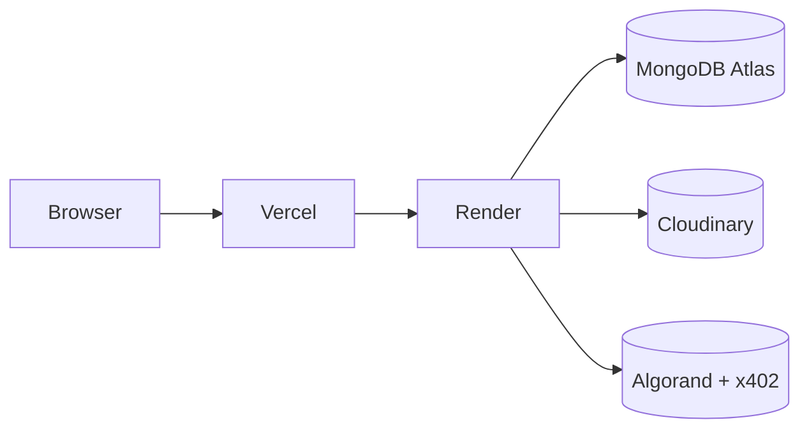

# AIHub Demo Marketplace

AIHub is a demo-first, pay-per-use AI agent marketplace built on Algorand and x402. It shows how users can browse AI agents, connect a Pera Wallet, pay only when an agent runs successfully, and receive an on-chain receipt for every execution.

## Demo At A Glance

- Browse and filter AI agents in a marketplace UI
- Open agent detail pages with pricing and execution flow
- View developer, admin, wallet, payment, history, analytics, profile, and settings pages
- Follow the x402 payment flow with Algorand settlement
- Run the demo backend without MongoDB when `DEMO_MODE=true`

## How The Demo Works

1. Open the landing page and browse featured agents.
2. Go to the marketplace and filter agents by category or search.
3. Open an agent to review pricing, tags, and the x402 payment flow.
4. Connect a wallet on the wallet page and move through the payment experience.
5. Check payments and history pages to see settled transactions and receipts.
6. Use the developer and admin dashboards to view publishing and moderation flows.

## Screenshots

Screenshots are not checked into the repo yet. If you add them later, this is a good place to show:

- Landing page
- Marketplace view
- Agent details
- Developer dashboard
- Admin dashboard

## Tech Stack

- Frontend: React 19, TypeScript, Vite, Tailwind CSS, React Router, TanStack Query, Chart.js
- Backend: Hono, Node.js, TypeScript, Mongoose
- Payments: x402 with Algorand testnet support
- Wallet: Pera Wallet
- Shared types and constants: `packages/shared`

## Project Structure

- `apps/web` - React demo UI
- `apps/api` - Hono API and x402 backend
- `packages/shared` - shared schemas, constants, and sample agent data
- `docs` - architecture, API, database, frontend, backend, payment, deployment, testing, and documentation notes

## Quick Start

1. Install dependencies from the repository root.
2. Copy `.env.example` to `.env` and adjust values if needed.
3. Start the web app and API together.
4. Open the demo in your browser.

```bash
npm install
npm run dev
```

The apps run at:

- Web: `http://localhost:5173`
- API: `http://localhost:8080`

## Demo Mode

Demo mode is enabled by default.

- `DEMO_MODE=true` lets the API boot without a MongoDB connection.
- If `MONGODB_URI` is empty, the backend also skips database connection.
- The frontend uses mock marketplace data for the demo UI.

If you want the full database-backed version, set:

- `DEMO_MODE=false`
- `MONGODB_URI` to a real MongoDB connection string

## How To Make It Real Time

The current demo uses mock data in the frontend, so updates are static until the page refreshes. To make it real time:

1. Store live state in MongoDB instead of local mock arrays.
2. Emit backend events whenever an agent is created, a payment settles, or a receipt is issued.
3. Push those events to the browser with Server-Sent Events or WebSockets.
4. Subscribe in the React app and call `queryClient.invalidateQueries()` or update cached data directly.
5. Add a small polling fallback for pages that do not need instant updates.

A practical setup for this repo would be:

- Use SSE for low-complexity updates such as history, payments, and analytics refreshes.
- Use WebSockets only if you need bidirectional chat-like interactions or live collaborative views.
- Keep React Query as the source of truth on the client so incoming events only refresh the affected queries.

## Payment Flow

To make the payment flow actually work end-to-end, run the app in non-demo mode and make sure every payment dependency is configured.

### Required Setup

1. Set `DEMO_MODE=false` in your `.env`.
2. Provide a valid `MONGODB_URI`.
3. Set `X402_FACILITATOR_URL` to a reachable facilitator.
4. Set `X402_NETWORK` to the network you want to use, usually `algorand:testnet` for local testing.
5. Set `X402_PAY_TO` to the Algorand address that receives payments.
6. Set `X402_ASSET` to the asset you want to settle in, usually `USDC`.
7. Set `CORS_ORIGIN` and `VITE_API_URL` so the frontend can talk to the backend.
8. Seed the database so there are approved agents and demo users available.

### Payment Sequence

1. Start the backend and frontend.
2. Sign in as a wallet-verified user.
3. Open an approved agent in the marketplace.
4. Click the pay-and-run action from the agent details page.
5. The API creates a transaction record and returns an x402 challenge when payment is required.
6. The frontend signs the payment with the connected wallet and retries the request.
7. The facilitator validates the payment and the backend settles the transaction.
8. The API stores the receipt and transaction history for later download.

### What The Backend Does

- `POST /agents/:id/run` creates a transaction draft and executes the agent.
- x402 middleware adds the payment challenge and checks the settlement flow.
- The settlement middleware watches for the `PAYMENT-RESPONSE` header.
- Once settlement succeeds, the backend issues a receipt and updates developer and agent usage totals.

### What The Frontend Needs

- A connected Pera Wallet
- A paid fetch wrapper for protected requests
- React Query cache updates after payment and receipt creation
- A clear success state that links to payments and history

### Troubleshooting

- If the flow never leaves demo behavior, confirm `DEMO_MODE=false`.
- If the backend refuses to start, verify `MONGODB_URI` and the x402 environment variables.
- If payment challenges are returned but never settle, check the facilitator URL, wallet/network mismatch, and `ENABLE_X402=true`.
- If receipts do not appear, inspect the `PAYMENT-RESPONSE` header handling and the transaction status in MongoDB.

## Environment Variables

The most important variables are:

- `PORT` - API port, default `8080`
- `DEMO_MODE` - demo toggle, default `true`
- `MONGODB_URI` - MongoDB connection string
- `JWT_SECRET` - access token secret
- `JWT_REFRESH_SECRET` - refresh token secret
- `X402_FACILITATOR_URL` - x402 facilitator endpoint
- `ENABLE_X402` - enable x402 payment middleware when your facilitator supports Algorand exact payments
- `X402_NETWORK` - `algorand:testnet` or `algorand:mainnet`
- `X402_PAY_TO` - Algorand payout address
- `X402_ASSET` - payment asset, default `USDC`
- `ALGORAND_NETWORK` - `testnet` or `mainnet`
- `ALGORAND_NODE_URL` - Algorand node URL
- `ALGORAND_INDEXER_URL` - Algorand indexer URL
- `CORS_ORIGIN` - frontend origin, default `http://localhost:5173`
- `VITE_API_URL` - frontend API base URL, default `http://localhost:8080`
- `GEMINI_API_KEY` - Google Gemini API key for real AI agent execution (preferred)
- `GEMINI_MODEL` - Gemini model name, default `gemini-1.5-flash`
- `OPENAI_API_KEY` - optional OpenAI-compatible fallback (used only if Gemini is not set)
- `LLM_MODEL` - model for the OpenAI-compatible fallback, default `gpt-4o-mini`

See [`.env.example`](./.env.example) for the full list.

## Optional Seed Data

If you are running the full Mongo-backed version, you can seed demo users, categories, and agents with:

```bash
npx tsx apps/api/src/scripts/seed.ts
```

This script expects `DEMO_MODE=false` and a working MongoDB connection.

## Deployment

Target platforms from the repo docs:

- Frontend: Vercel
- Backend: Render
- Database: MongoDB Atlas
- Storage: Cloudinary

### Deployment Flow

1. Install workspace dependencies.
2. Build the shared package first.
3. Build the API and web applications.
4. Set environment variables in Vercel and Render.
5. Verify x402 facilitator connectivity.
6. Test the payment flow on Algorand testnet before moving to mainnet.

### Deployment Diagram



## Available Scripts

From the repository root:

```bash
npm run dev        # run API and web together
npm run dev:api    # API only
npm run dev:web    # web only
npm run build      # build shared, API, and web
npm run lint       # lint all workspaces
npm run test       # run all tests
npm run typecheck  # type-check all workspaces
npm run format     # format the repo with Prettier
```

## Main Routes

- `/` - landing page
- `/marketplace` - browse and filter agents
- `/marketplace/:id` - agent details
- `/developer` - developer dashboard
- `/admin` - admin dashboard
- `/wallet` - Pera Wallet page
- `/payments` - payment activity
- `/history` - execution history
- `/analytics` - analytics dashboard
- `/profile` - profile page
- `/settings` - settings page

## API Health Check

```bash
GET /health
```

The health endpoint returns a simple JSON response with service status and timestamp.

## Notes

- The repository is organized as a monorepo with npm workspaces.
- Shared agent categories and sample agents live in `packages/shared`.
- The backend supports x402 protected routes and Algorand settlement flow.
- The demo UI is designed to be easy to present without requiring production infrastructure.
- For workflow automation and external agent orchestration, see [docs/11-n8n-integration.md](./docs/11-n8n-integration.md).
